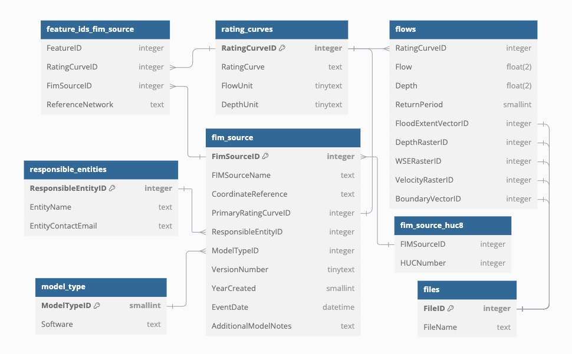

# FIM_database
Files and code for populating a Flood Inundation Mapping (FIM) database.

The Google Colab notebooks in this repository can be used to build and populate a Flood Inundation Mapping (FIM) Database that follows the format made in our study. The notebook can also be used to populate an existing database with the correct format. Tools to find the HUC8 and National Water Model feature ids to include in the database are also linked to in the notebook. These tools enable a connection with the National Water Model, allowing for the use of user created flood maps in relation to the National Water Model forecasts.

The database is organized according to the following relational diagram: 

You can view the DataImporter code in Google Colab at the following link:

 

You can view the FindInputData code in Google Colab at the following link:

   
